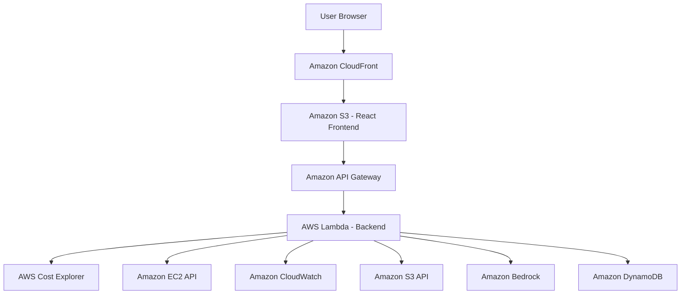

# 🛡️ CloudGuard AI

> **Understand your cloud. Optimize your infrastructure. Ship smarter.**

[](https://github.com/vedanshg7572/cloudproject)
[]()
[]()
[]()

An AI-powered AWS cloud cost and resource optimization copilot that transforms infrastructure data into actionable insights — so engineering teams can focus on shipping, not billing.

---

## 🚨 Problem

Developers and small teams deploy AWS resources quickly but rarely maintain continuous visibility into where cloud spending is going. The result:

- 🔍 **Opaque bills** — hundreds of line items with no clear story
- 💸 **Silent waste** — unused EBS volumes, oversized EC2s, forgotten resources
- 🧠 **No easy answers** — AWS Cost Explorer is powerful but needs FinOps expertise

## ✅ Solution

CloudGuard AI connects to your AWS account (read-only), analyzes cost and resource data, and delivers:

- Plain-English AI explanations via Amazon Bedrock
- Prioritized optimization recommendations
- What-If savings simulator
- Full resource inventory with utilization signals
- Optimization score (0–100)

---

## ✨ Features

| Feature | Description |
|---------|-------------|
| 📊 Dashboard | Executive view — spend, savings, score, trends |
| 🤖 AI Copilot | Ask questions about your AWS environment |
| 💡 Recommendations | Prioritized HIGH/MEDIUM/LOW action cards |
| 💰 Cost Explorer | Service breakdown, daily spend, 6-month trend |
| 🖥️ Resource Inventory | EC2, S3, EBS, RDS, Lambda table with filters |
| 🎛️ Optimization Simulator | What-if scenario modeler |
| ⚙️ Settings | AWS connection setup guide |
| 🎭 Demo Mode | Fully functional without any AWS account |

---

## 🏗️ Architecture



---

## ☁️ AWS Services Used

| Service | Purpose |
|---------|---------|
| Amazon S3 | Frontend hosting |
| Amazon CloudFront | CDN + HTTPS delivery |
| Amazon API Gateway | REST API endpoints |
| AWS Lambda | Serverless backend handlers |
| AWS Cost Explorer | Real cost and usage data |
| Amazon EC2 API | Resource discovery |
| Amazon CloudWatch | Utilization metrics |
| Amazon Bedrock | AI recommendations (Claude) |
| Amazon DynamoDB | Settings persistence (optional) |

---

## 🤖 AI Architecture

```
User Question
     ↓
Backend validates + sanitizes input
     ↓
Builds infrastructure context summary:
  - Monthly spend, top services, resource count
  - Active recommendations
     ↓
Amazon Bedrock (Claude claude-3-haiku)
     ↓
Structured response with:
  - Explanation
  - Priority actions
  - Risk considerations
     ↓
Frontend renders (no AWS keys in browser)
```

> If Bedrock is unavailable, CloudGuard AI gracefully falls back to built-in analytical responses.

---

## 🚀 Local Development Setup

### Prerequisites
- Node.js v18+
- npm v9+

### 1. Clone the repo
```bash
git clone https://github.com/vedanshg7572/cloudproject.git
cd cloudproject
```

### 2. Start Frontend
```bash
cd frontend
npm install
npm run dev
# → http://localhost:5173
```

### 3. Start Backend (Demo Mode — no AWS needed)
```bash
cd backend
npm install
cp .env.example .env
# Leave DEMO_MODE=true for local testing
npm run dev
# → http://localhost:4000
```

### 4. Open the app
Visit `http://localhost:5173` — fully functional in demo mode!

---

## 🔐 Environment Variables

Create `backend/.env` from `backend/.env.example`:

```env
# AWS Core (leave blank for demo mode)
AWS_REGION=us-east-1
AWS_ACCESS_KEY_ID=
AWS_SECRET_ACCESS_KEY=

# Amazon Bedrock AI
BEDROCK_ENABLED=false
BEDROCK_REGION=us-east-1
BEDROCK_MODEL_ID=anthropic.claude-3-haiku-20240307-v1:0

# App
PORT=4000
DEMO_MODE=true
FRONTEND_URL=http://localhost:5173
```

> ⚠️ **Never commit `.env` to git!** It's in `.gitignore`.

---

## 🛡️ Security

- ✅ AWS credentials stored **server-side only** — never in browser
- ✅ **Read-only IAM permissions** — cannot modify or delete resources
- ✅ No automated destructive actions
- ✅ All recommendations require explicit human review
- ✅ Input validation on all API endpoints
- ✅ CORS restricted to frontend origin
- ✅ No internal error details exposed to client

### Minimum IAM Policy Required
```json
{
  "Version": "2012-10-17",
  "Statement": [
    {
      "Effect": "Allow",
      "Action": [
        "ce:GetCostAndUsage",
        "ec2:DescribeInstances",
        "ec2:DescribeVolumes",
        "s3:ListAllMyBuckets",
        "cloudwatch:GetMetricData",
        "cloudwatch:ListMetrics",
        "bedrock:InvokeModel"
      ],
      "Resource": "*"
    }
  ]
}
```

---

## 🎭 Demo Mode

CloudGuard AI works **without any AWS account** using realistic seeded data:

- Monthly spend: $184.72
- 27 resources across 2 regions
- 3 prioritized recommendations
- 81/100 optimization score
- Full AI Copilot responses
- Working cost charts and trends

Demo mode is clearly labeled throughout the UI with a `DEMO ENVIRONMENT` badge.

---

## ☁️ AWS Deployment

### Frontend → S3 + CloudFront
```bash
cd frontend
npm run build
# Upload dist/ to S3 bucket
aws s3 sync dist/ s3://your-bucket-name --delete
# Invalidate CloudFront cache
aws cloudfront create-invalidation --distribution-id YOUR_ID --paths "/*"
```

### Backend → Lambda + API Gateway
```bash
cd backend
npm run build
# Zip and deploy to Lambda
zip -r function.zip dist/ node_modules/
aws lambda update-function-code --function-name cloudguard-ai --zip-file fileb://function.zip
```

See `docs/DEPLOYMENT.md` for full step-by-step instructions.

---

## 🗺️ Future Roadmap

- [ ] Multi-account AWS Organizations support
- [ ] Slack / Teams alerts for cost anomalies
- [ ] Automated savings tracking over time
- [ ] Terraform / CDK export of recommendations
- [ ] Scheduled weekly optimization reports
- [ ] Cost allocation by team/tag

---

## 🏆 Hackathon Submission

- **Event:** AWS "Zero to Shipped" Hackathon 2026
- **Category:** #workplace-efficiency
- **Lane:** #startups
- **GitHub:** https://github.com/vedanshg7572/cloudproject
- **Live URL:** *(to be updated after AWS deployment)*

---

> ⚠️ **Disclaimer:** CloudGuard AI is not affiliated with or endorsed by Amazon Web Services, Inc. AWS® is a trademark of Amazon.com, Inc. All estimated savings are projections, not guarantees. Optimization Score is an analytical metric by CloudGuard AI, not an AWS-certified rating. Demo data is simulated.
